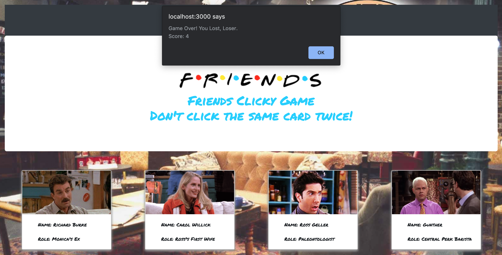

# friendsclickygame

## Contributor
Jenni Birsan //
IG: jennibirsan

## About
This Clicky Game is a 'Friends' themed memory game, where you must click each card once in order to win. The highest score you can get is 12, and once you do, an alert will appear letting you know that you completed the game. It will then restart and reset the scores for you. However, if you accidently click the same card twice, an alert will appear that you lost the game. The game will restart and the score will reset, however, your current highscore will be maintained until you reach 12. 

## Languages Used
React JS
Javascript
JSX
CSS
HTML

## Deployed Link
https://jennibirsan.github.io/clickygame-deploy/

## Main Page
(this is the main page before you begin playing)

## Main Page
(these are all the cards / characters)

## Once You Lose
(this is the alert for when you click the same card twice, aka you lose)

## Maintain High Score
(this shows how it maintains your highscore, even though you lost. your initial score resets, though)

## Winning
(this shows the alert for when you correctly click the 12 images without repeating)

## Restarting After Winning
(this shows how the score and highscore completely resets after you win the game)

